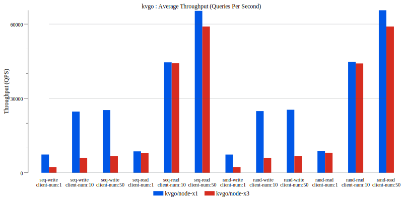
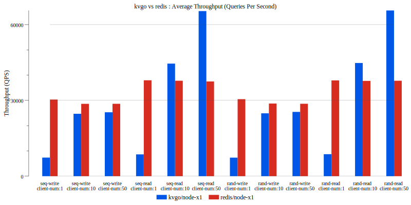

# kvgo-server

kvgo-server is the cluster mode that based on [kvgo](https://github.com/lynkdb/kvgo-server) project.


## Features

* fast and persistent key-value storage engine based on [goleveldb](github.com/syndtr/goleveldb).
* data is stored sorted by key, forward and backward query is supported over the data.
* data is automatically compressed using the snappy.
* support paxos-based distributed deployment and provide service via gRPC

## Getting Started

### Installing


``` shell
# RHEL 7.x, CentOS 7.x, Ubuntu 18.04

git clone https://github.com/lynkdb/kvgo-server.git
cd kvgo-server
make
make install
systemctl enable kvgo-server
systemctl start kvgo-server

# Confirm that the service is running
systemctl status kvgo-server
```

## Setting up the server to run as a single instance

This is the default configuration when the service is first started:

``` toml
# vim /opt/lynkdb/kvgo-server/etc/kvgo-server.conf

# Storage Settings
[storage]
data_directory = "/opt/lynkdb/kvgo-server/var/data"

# Server Settings
[server]
bind = "127.0.0.1:9100"
auth_secret_key = "the-secret-key-of-server"
```

You can modify the default configuration and finally restart the service:

``` shell
systemctl restart kvgo-server
```

### Setting up a typical 3 replica cluster

Prepare 3 servers, install the kvgo-server and setting up them like the following:


# server-01
``` toml
# vim /opt/lynkdb/kvgo-server/etc/kvgo-server.conf

[storage]
data_directory = "/opt/lynkdb/kvgo-server/var/data-01"

[server]
bind = "127.0.0.1:9100"
auth_secret_key = "the-secret-key-of-server-01"

[[cluster.masters]]
addr = "127.0.0.1:9100"
auth_secret_key = "the-secret-key-of-server-01"

[[cluster.masters]]
addr = "127.0.0.2:9100"
auth_secret_key = "the-secret-key-of-server-02"

[[cluster.masters]]
addr = "127.0.0.3:9100"
auth_secret_key = "the-secret-key-of-server-03"
```

# server-02
``` toml
[storage]
data_directory = "/opt/lynkdb/kvgo-server/var/data-02"

[server]
bind = "127.0.0.2:9100"
auth_secret_key = "the-secret-key-of-server-02"

[[cluster.masters]]
addr = "127.0.0.1:9100"
auth_secret_key = "the-secret-key-of-server-01"

[[cluster.masters]]
addr = "127.0.0.2:9100"
auth_secret_key = "the-secret-key-of-server-02"

[[cluster.masters]]
addr = "127.0.0.3:9100"
auth_secret_key = "the-secret-key-of-server-03"
```

# server-03
``` toml
[storage]
data_directory = "/opt/lynkdb/kvgo-server/var/data-03"

[server]
bind = "127.0.0.3:9100"
auth_secret_key = "the-secret-key-of-server-03"

[[cluster.masters]]
addr = "127.0.0.1:9100"
auth_secret_key = "the-secret-key-of-server-01"

[[cluster.masters]]
addr = "127.0.0.2:9100"
auth_secret_key = "the-secret-key-of-server-02"

[[cluster.masters]]
addr = "127.0.0.3:9100"
auth_secret_key = "the-secret-key-of-server-03"
```

## Improve Performance

``` toml
# vim /opt/lynkdb/kvgo-server/etc/kvgo-server.conf

[performance]
# in MiB, default to 8
write_buffer_size = 8

# in MiB, default to 32
block_cache_size = 32

# in MiB, default to 8
max_table_size = 8

# default to 500
max_open_files = 500
```

## Usage

kvgo-server provide public service via gRPC, currently the default SDK is [kvgo](https://github.com/lynkdb/kvgo) that only for golang, more of other programming languages may be supported in future.

go to SDK [kvgo](https://github.com/lynkdb/kvgo).


## Performance


### test environment

* CPU: Intel i7-7700 CPU @ 3.60GHz (4 cores, 8 threads)
* SSD: Intel 760P 512GB M.2/NVMe
* OS: CentOS 7.7.1908 x86_64
* kvgo: version 0.2.0 (write_buffer 64MB, block_cache_size 64MB)
* redis: version 5.0.7 (disable save the DB on disk)
* data keys: 40 bytes each
* data values: 1024 bytes each

### typical performance in 1 node and 3 nodes modes:




### kvgo vs redis in 1 node mode:




## Dependent or referenced

* leveldb [https://github.com/google/leveldb](https://github.com/google/leveldb)
* goleveldb [github.com/syndtr/goleveldb](github.com/syndtr/goleveldb)
* snappy [http://github.com/google/snappy](http://github.com/google/snappy)
* snappy in go [https://github.com/golang/snappy](https://github.com/golang/snappy)
